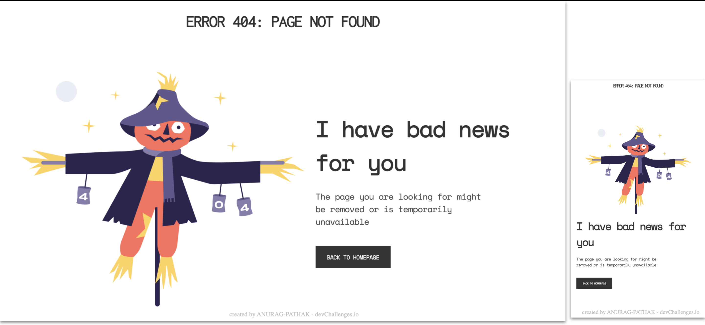

<!-- Please update value in the {}  -->

<h1 align="center">404 NOT FOUND</h1>

   Solution for a challenge from  <a href="http://devchallenges.io" target="_blank">Devchallenges.io</a>.

  <h3>
    <a href="https://anurag-pathak.github.io/404-not-found/">
      Demo
    </a>
     | 
    <a href="https://github.com/ANURAG-PATHAK/404-not-found">
      Solution
    </a>
     | 
    <a href="https://legacy.devchallenges.io/challenges/wBunSb7FPrIepJZAg0sY">
      Challenge
    </a>
  </h3>

<!-- TABLE OF CONTENTS -->

## Table of Contents

- [Overview](#overview)
  - [Built With](#built-with)
- [Features](#features)
- [Contact](#contact)

<!-- OVERVIEW -->

## Overview

This is a simple 404 Not found webpage.

- Demo can be seen here 
- It was a nice experince creating this.
- I learned about viewport height and width, improved on flexbox.

### Built With

<!-- This section should list any major frameworks that you built your project using. Here are a few examples.-->

- HTML
- CSS

## Features

<!-- List the features of your application or follow the template. Don't share the figma file here :) -->

This application/site was created as a submission to a [DevChallenges](https://devchallenges.io/challenges) challenge. The [challenge](https://legacy.devchallenges.io/challenges/wBunSb7FPrIepJZAg0sY) was to create a 404 not found page.

## Contact

- [Website](https://anurag-pathak.github.io/Portfolio/)
- [GitHub](https://ANURAG-PATHAK)
- [Twitter](https://twitter.com/_Anurag__Pathak)
- [LinkedIn](https://www.linkedin.com/in/anuragpathak0/)
